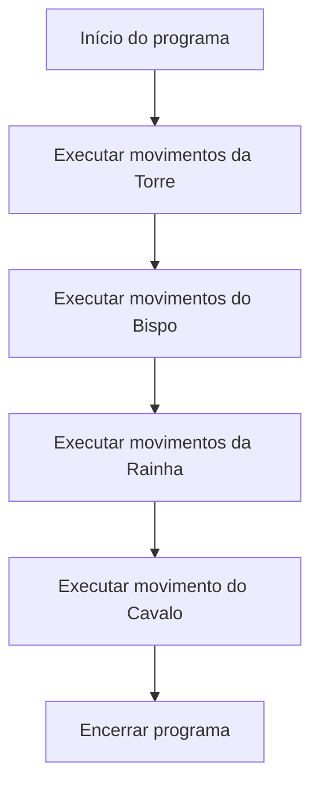

<div align="center">

# ♟️ Simulador de Movimentos de Xadrez em C

Desafio de programação desenvolvido em C para praticar estruturas de repetição, loops aninhados, recursividade e controle de fluxo por meio da movimentação de peças de xadrez.


</div>

---

## 📌 Sobre o projeto

Este projeto simula movimentos de peças de xadrez utilizando a linguagem C.

O desafio foi desenvolvido com o objetivo de praticar diferentes formas de controle do fluxo de execução, incluindo:

* estruturas de repetição;
* loops aninhados;
* funções;
* funções recursivas;
* condições de parada;
* uso de `break`;
* uso de `continue`;
* constantes definidas com `#define`.

As peças são utilizadas como contexto para representar diferentes padrões de movimentação no tabuleiro.

> Este projeto não implementa uma partida completa de xadrez. O foco está na lógica utilizada para representar e exibir os movimentos das peças.

---

## 🎯 Objetivos de aprendizagem

Os principais objetivos do desafio são:

* praticar a linguagem C;
* compreender estruturas de repetição;
* trabalhar com loops aninhados;
* criar funções para separar responsabilidades;
* compreender o funcionamento da recursividade;
* definir condições de parada;
* utilizar `break` e `continue`;
* representar movimentos por meio de algoritmos;
* melhorar a organização e a legibilidade do código.

---

## ♟️ Peças implementadas

O programa apresenta movimentos para quatro peças:

* Torre;
* Bispo;
* Rainha;
* Cavalo.

Cada peça utiliza uma estratégia diferente para demonstrar conceitos da linguagem C.

---

## 🏰 Torre

A torre se movimenta em linhas retas:

* para cima;
* para baixo;
* para a esquerda;
* para a direita.

No projeto, esses movimentos são demonstrados por meio de uma função recursiva.

```c
void torre_recursiva(int passos) {
    if (passos == 0) {
        return;
    }

    printf("Cima\n");
    torre_recursiva(passos - 1);

    printf("Baixo\n");
    torre_recursiva(passos - 1);

    printf("Esquerda\n");
    torre_recursiva(passos - 1);

    printf("Direita\n");
    torre_recursiva(passos - 1);
}
```

### Conceitos praticados

* função recursiva;
* condição de parada;
* decremento do parâmetro;
* chamadas sucessivas;
* representação de movimentos ortogonais.

---

## ⛪ Bispo

O bispo realiza movimentos diagonais.

No código, sua movimentação utiliza:

* loops aninhados;
* comparação entre índices;
* impressão de direções diagonais;
* chamada recursiva.

As condições utilizadas representam:

```c
if (i == j) {
    printf("Diagonal Cima-Direita\n");
}
```

e:

```c
else if (i + j == passos + 1) {
    printf("Diagonal Cima-Esquerda\n");
}
```

### Conceitos praticados

* loops `for` aninhados;
* comparação de coordenadas;
* condições compostas;
* diagonais em uma matriz;
* recursividade.

---

## 👑 Rainha

A rainha combina os movimentos da torre e do bispo.

Ela pode se mover:

* para cima;
* para baixo;
* para a esquerda;
* para a direita;
* nas quatro direções diagonais.

A função da rainha demonstra todas essas direções utilizando chamadas recursivas.

### Movimentos representados

```text
Cima
Baixo
Esquerda
Direita
Diagonal Cima-Direita
Diagonal Cima-Esquerda
Diagonal Baixo-Direita
Diagonal Baixo-Esquerda
```

### Conceitos praticados

* combinação de diferentes padrões de movimento;
* chamadas recursivas;
* múltiplos caminhos de execução;
* decomposição de um problema complexo.

---

## 🐴 Cavalo

O cavalo possui um movimento diferente das outras peças.

Ele se movimenta em formato de `L`, geralmente combinando:

* duas casas em uma direção;
* uma casa em uma direção perpendicular.

No projeto, o movimento representado é:

```text
Cima
Cima
Direita
```

A implementação utiliza dois loops aninhados e verifica se o movimento permanece dentro dos limites do tabuleiro.

```c
if (i - 2 >= 1 && j + 1 <= TABULEIRO) {
    printf("Cima\n");
    printf("Cima\n");
    printf("Direita\n");
    break;
} else {
    continue;
}
```

### Conceitos praticados

* loops aninhados;
* condições múltiplas;
* limites do tabuleiro;
* `break`;
* `continue`;
* simulação do movimento em `L`.

---

## 🧱 Funcionamento geral

O fluxo do programa pode ser representado da seguinte forma:



No método `main`, cada função é chamada sequencialmente:

```c
int main() {
    printf("Movimentos da Torre:\n");
    torre_recursiva(PASSOS);

    printf("\nMovimentos do Bispo:\n");
    bispo_recursivo(PASSOS);

    printf("\nMovimentos da Rainha:\n");
    rainha_recursiva(PASSOS);

    printf("\nMovimentos do Cavalo:\n");
    cavalo_movimentos();

    return 0;
}
```

---

## ⚙️ Constantes utilizadas

O programa define duas constantes:

```c
#define TABULEIRO 8
#define PASSOS 2
```

| Constante   | Finalidade                                          |
| ----------- | --------------------------------------------------- |
| `TABULEIRO` | Representa as oito linhas e colunas de um tabuleiro |
| `PASSOS`    | Controla a profundidade das chamadas recursivas     |

O uso de constantes evita a repetição de valores fixos e facilita futuras alterações.

---

## 🛠️ Tecnologias utilizadas

| Tecnologia | Aplicação                          |
| ---------- | ---------------------------------- |
| C          | Implementação dos algoritmos       |
| GCC        | Compilação do programa             |
| Git        | Controle de versão                 |
| GitHub     | Armazenamento e documentação       |
| VS Code    | Desenvolvimento e edição do código |

---

## 📁 Estrutura do repositório

```text
cursos-ti-desafio-xadrez-DesafioXadrez/
│
├── xadrez.c
└── README.md
```

| Arquivo     | Descrição                              |
| ----------- | -------------------------------------- |
| `xadrez.c`  | Implementação dos movimentos das peças |
| `README.md` | Documentação do desafio                |

---

## 🚀 Como executar

### Pré-requisitos

Para executar o projeto, é necessário possuir:

* Git;
* compilador GCC ou compatível;
* terminal, Prompt de Comando ou PowerShell.

---

### 1. Clone o repositório

```bash
git clone https://github.com/ONestoDev/cursos-ti-desafio-xadrez-DesafioXadrez.git
```

### 2. Acesse a pasta

```bash
cd cursos-ti-desafio-xadrez-DesafioXadrez
```

### 3. Compile o código

```bash
gcc xadrez.c -o xadrez
```

É recomendável habilitar avisos do compilador:

```bash
gcc -Wall -Wextra -pedantic xadrez.c -o xadrez
```

### 4. Execute o programa

No Windows:

```bash
xadrez.exe
```

No Linux ou macOS:

```bash
./xadrez
```

---

## 🧠 Recursividade

Uma função recursiva é uma função que chama a si mesma.

Para que a recursividade termine corretamente, deve existir uma condição de parada.

Exemplo utilizado no projeto:

```c
if (passos == 0) {
    return;
}
```

Depois da verificação, a função é chamada novamente com um valor menor:

```c
torre_recursiva(passos - 1);
```

O fluxo conceitual é:

```text
passos = 2
    ↓
passos = 1
    ↓
passos = 0
    ↓
encerramento
```

Sem uma condição de parada, a função continuaria criando novas chamadas até consumir a memória disponível para a pilha de execução.

---

## 🔁 Loops aninhados

Loops aninhados são estruturas de repetição inseridas dentro de outras estruturas de repetição.

Exemplo:

```c
for (int i = 1; i <= TABULEIRO; i++) {
    for (int j = 1; j <= TABULEIRO; j++) {
        // processamento
    }
}
```

Esse tipo de estrutura é útil para percorrer:

* matrizes;
* tabelas;
* tabuleiros;
* coordenadas;
* combinações entre valores.

Em um tabuleiro, `i` pode representar a linha e `j` pode representar a coluna.

---

## ⛔ Break e continue

### `break`

O comando `break` encerra imediatamente o loop atual.

No movimento do cavalo, ele é utilizado depois que uma posição válida é encontrada:

```c
break;
```

### `continue`

O comando `continue` ignora o restante da iteração atual e avança para a próxima.

```c
continue;
```

No projeto, ele é utilizado quando uma posição não permite o movimento definido para o cavalo.

---

## 📚 Aprendizados desenvolvidos

Durante o desenvolvimento deste desafio foram praticados:

* sintaxe da linguagem C;
* criação de funções;
* passagem de parâmetros;
* estruturas de repetição;
* loops aninhados;
* estruturas condicionais;
* operadores relacionais;
* operadores lógicos;
* recursividade;
* condições de parada;
* uso de `break`;
* uso de `continue`;
* constantes com `#define`;
* representação de coordenadas;
* organização do código;
* compilação pelo terminal.

---

## ⚠️ Limitações

Este projeto possui finalidade educacional.

A implementação não inclui:

* representação gráfica do tabuleiro;
* posição inicial de cada peça;
* armazenamento do estado do jogo;
* jogadores;
* turnos;
* captura de peças;
* xeque;
* xeque-mate;
* validação completa das regras oficiais;
* entrada interativa;
* movimentação real entre coordenadas.

As funções imprimem direções no terminal para demonstrar estruturas de programação.

---

## 🗺️ Possíveis melhorias

O projeto poderá evoluir com:

* representação do tabuleiro por uma matriz;
* escolha da peça pelo usuário;
* entrada da posição inicial;
* cálculo da posição final;
* validação dos limites do tabuleiro;
* prevenção de movimentos inválidos;
* separação do código em arquivos `.c` e `.h`;
* testes automatizados;
* implementação das demais peças;
* exibição das coordenadas;
* menu interativo;
* redução da repetição nas funções recursivas;
* implementação de uma partida simplificada.

---

## 🎓 Contexto educacional

Projeto desenvolvido como parte de um desafio acadêmico de programação em C.

A atividade utiliza movimentos de peças de xadrez como contexto para estudar estruturas de repetição, loops aninhados, funções recursivas e controle de fluxo.

---

## 👨‍💻 Autor

Desenvolvido por **Ernesto — ONestoDev**.

[](https://github.com/ONestoDev)

---

## 📄 Licença

Este projeto possui finalidade educacional.

Os materiais e enunciados originais pertencem às respectivas instituições responsáveis pelo conteúdo.
